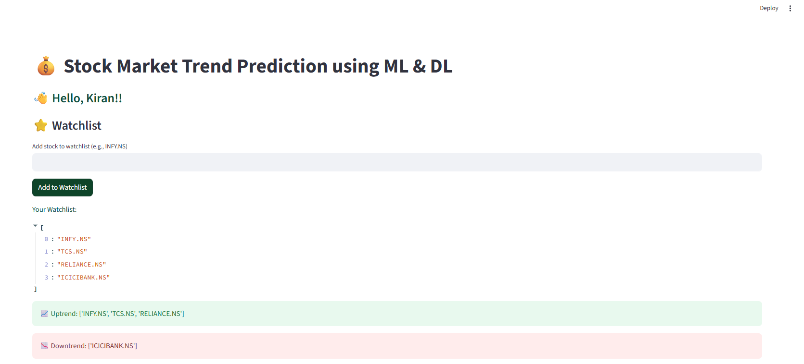

# 💰 Stock Market Trend Predictor using ML & DL

A powerful **Streamlit-based web app** that predicts **stock market trends** using a combination of **Machine Learning (Random Forest, SVM, XGBoost)** and **Deep Learning (LSTM)** models. The app fetches real-time stock data using `yfinance` and computes technical indicators like **RSI, MACD, SMA, OBV, ROC**, etc., to forecast price direction.


---

## 🚀 Features

- 📊 Real-time stock data fetching using **Yahoo Finance**
- 🔍 Predict trend using ML (Random Forest, SVM, XGBoost)
- 🤖 Predict trend using DL (LSTM Neural Network)
- 📉 Technical indicators: SMA, EMA, MACD, RSI, OBV, Momentum, etc.
- ⭐ Add stocks to your **watchlist**
- 👤 Personalized welcome message for logged-in users
- 🧠 Trend prediction feedback from model
- 🧼 Clean, interactive **Streamlit UI**

---

## 📷 Screenshots

| Search for Stock | Trend of Searched Stock |
|------------------|-------------------------|
|  |  |


---

## 📚 Watchlist Feature

Add your favorite stocks (e.g., `INFY.NS`, `TCS.NS`) to track their predicted trend direction.



---

## 🛠️ Tech Stack

- **Frontend:** Streamlit
- **Backend:** Python
- **ML Models:** Random Forest, SVM, XGBoost
- **DL Models:** LSTM (Keras/TensorFlow)
- **Libraries:** pandas, numpy, matplotlib, yfinance, scikit-learn, tensorflow, xgboost

---

## ⚙️ Installation & Running Locally

### 1. Clone the Repository
```bash
git clone https://github.com/KIRANRW9/stock-trend-predictor.git
cd stock-trend-predictor
```

### 2. Create a Virtual Environment (Optional)
```bash
python -m venv venv
venv\Scripts\activate   # On Windows
```

### 3. Install Required Libraries
```bash
pip install -r requirements.txt
```

### 4. Run the Streamlit App
```bash
streamlit run stock_trend_app.py
```

---

## 📁 Folder Structure

```
stock-trend-predictor/
├── assets/
│   ├── Search for stock.png
│   ├── Trend of searched stock.png
│   ├── Watchlist.png
│   └── User Dashboard.png
├── stock_trend_app.py
├── requirements.txt
└── README.md
```

---

## ✍️ Author

**Kiran Rangu**  
💼 [GitHub: KIRANRW9](https://github.com/KIRANRW9)

---
